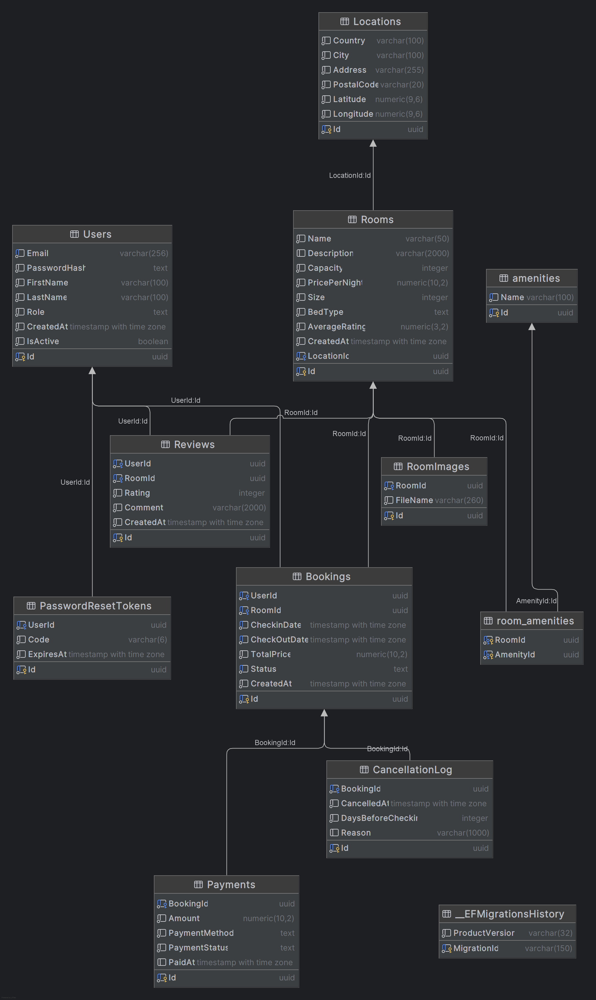

# SmartStay

SmartStay is an AI-powered booking platform developed using **C# and ASP.NET**.  
The system allows users to search and reserve rooms while using **Artificial Intelligence to recommend the best rooms**.

---

# Overview

SmartStay combines a traditional booking platform with intelligent decision support features.

Users can browse rooms, make reservations, and manage their bookings while AI components help improve the experience through:

- intelligent room recommendations
- smart search
- automated support assistance

The goal of the project is to explore how AI can improve **user experience and system efficiency** in booking platforms.

---

# Key Features

## User Management

- User registration
- Secure login and authentication
- User profile management
- Booking history
- JWT-based authentication

---

## Room Management

Features include:

- Create rooms
- Update room information
- Delete rooms
- Manage room availability
- Define room capacity
- Upload room images
- Manage amenities (WiFi, balcony, AC, etc.)

Room attributes include:

- capacity
- size
- price
- amenities
- bed type
- rating
- availability

---

## Booking System

Core functionality of the platform.

Users can:

- Search available rooms
- Create reservations
- Modify reservations
- Cancel reservations
- View reservation history

The system automatically handles:

- availability validation
- date conflict detection
- price calculation

---

## Smart Room Recommendation (AI)

The system recommends the most suitable rooms based on **user preferences**.

User preferences may include:

- budget
- number of guests
- preferred amenities
- room rating
- room type

The AI recommendation engine calculates a **match score** for each room and returns the best options.

Example result:

1. Deluxe Room — 92% match  
2. Sea View Room — 88% match  
3. Standard Room — 81% match  

The recommendation score is calculated using factors such as:

- price compatibility
- amenities match
- room capacity
- room rating
- popularity

---

## Smart Search

Advanced filtering system for discovering rooms.

Filters include:

- price range
- number of guests
- amenities
- rating
- availability dates

Sorting options:

- price
- rating
- AI recommendation score

---

## Reviews and Ratings

After completing a stay, users can leave feedback.

Features include:

- room rating
- written reviews
- average rating calculation

Ratings are also used as an input factor for the **AI recommendation system**.

---

## AI Customer Support Assistant

An integrated assistant helps users solve common issues related to bookings.

Examples of supported questions:

- how to cancel a reservation
- how to change reservation dates
- booking issues
- account problems

The assistant provides automated responses based on system documentation.

---

# AI Components

## Room Recommendation Engine

The recommendation engine calculates a score for each room based on multiple factors.

Example scoring formula:

Score =  
0.35 × Price Match  
0.25 × Amenities Match  
0.20 × Capacity Match  
0.10 × Room Rating  
0.10 × Popularity  

Rooms with the highest score are recommended to the user.

---

# Technology Stack

## Backend

- ASP.NET Core Web API
- Entity Framework Core

## Frontend

- Blazor
  
## Database

- PostgreSQL

## Artificial Intelligence

- Ollama 

## Authentication

- JWT Authentication

